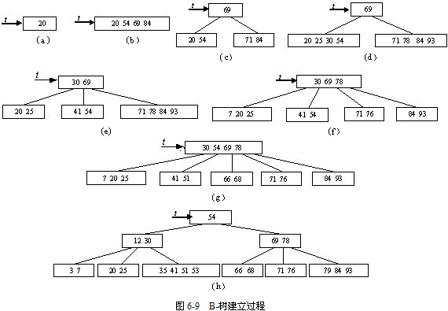
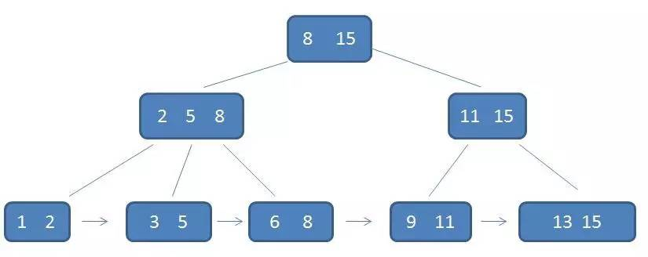

# B-树
## B-树定义
B-树上每个节点包含多个关键码从小到大排序，是一种平衡的多路查找树。

一颗**m阶**的B-树的特性如下：

1. 树中每个结点最多含有m颗子树（**m>=2**）；

2. 除根结点和叶子结点外，其它每个结点至少有 **ceil(m / 2)** 颗子树；

3. 若根结点不是叶子结点，则至少有2颗子树；

4. 所有叶子结点都出现在同一层，叶子结点不包含任何关键字信息；

5. 每个非终端结点中包含有n个关键字信息： (n，P0，K1，P1，K2，P2，......，Kn，Pn)。其中：
- Ki (i=1...n)为关键字，且关键字按顺序升序排序K(i-1)< Ki。 
- Pi为指向子树根的接点，且指针P(i-1)指向子树种所有结点的关键字均小于Ki，但都大于K(i-1)。 
- 关键字的个数n必须满足： ceil(m / 2) - 1 <= n <= m-1。

## B-树的插入
### 在B-树中插入关键码的思路
对高度为h的m阶B-树，新结点一般是插在第h层。通过检索可以确定关键码应插入的结点位置，分以下两种情况插入：
1. 若该结点中关键码个数小于m-1，则直接插入即可；

2. 若该结点中关键码个数等于m-1，则将引起结点的分裂。以中间关键码为界将结点一分为二，产生一个新结点，并把中间关键码插入到父结点（h-1层）中；重复上述工作，最坏的情况一直分裂到根结点，建立一个新的根结点，整个B-树增加一层。

### 插入
对关键码序列｛C，N，G，A，H，E，K，Q，M，F，W，L，T，Z，D，P，R，X，Y，S｝，建立**5阶**B-树的过程:
1. 向空树中插入C，N，G，A，按升序排序；

2. 插入H时，含有A，C，G，N的结点空间不够，将分裂成2个结点，然后把中间关键码G上移到新的根结点中；指针区域为 < G、> G；

3. 插入E，K，Q时，直接插入；

4. 插入M时，含有H，K，N，Q的结点需要分裂，然后把中间关键码M上移到父节点中；指针区域为 < G、(G,M)、> M；

5. 插入F，W，L，T时，直接插入；

6. 插入Z时，含有N，Q，T，W的结点需要分裂，然后把中间关键码T上移到父节点中；指针区域为 < G、(G,M)、(M,T)、> T；

7. 插入D时，含有A，C，E，F的结点需要分裂，然后把中间关键码D上移到父节点中，再直接插入P，R，X，Y；指针区域为 < D、(D,G)、(G,M)、(M,T)、> T；

8. 插入S时，含有N，P，Q，R的结点需要分裂，然后把中间关键码Q上移到父节点中，这时父节点的空间已经满了，所以也要进行分裂，将父节点中的中间关键码M上移到新形成的根结点中。

### 练习

对关键码序列｛20，54，69，84，71，30，78，25，93，41，7，76，51，66，68，53，3，79，35，12｝，建立**5阶**B-树的过程如图6-9所示。
1. 向空树中插入20，得图6-9（a）。

2. 插入54，69，84，得图6-9（b）。

3. 插入71，索引项达到5，要分裂成三部分：{20，54}，{69}和{71，84}，并将69上升到该结点的父结点中，得图6-9（c）。

4. 插入30，78，25，93，得图6-9（d）。

5. 插入41，又分裂得图6-9（e）。

6. 7直接插入。

7. 76插入，分裂得图6-9（f）。

8. 51，66直接插入，当插入68，需分裂，得图6-9（g）。

9. 53，3，79，35直接插入，12插入时，需分裂，但中间关键码12插入父结点时，又需要分裂，则54上升为新根。15，65直接插入得图6-9（h）。
  

## B-树的删除
### 在B-树中删除关键码的思路
- 被删关键码所在结点中的关键码个数**n >= ceil(m / 2)**，说明删去该关键码后该结点仍满足B-树的定义，这种情况只需从该结点中直接删去关键码即可。

- 被删关键码所在结点中关键码个数**n = ceil(m / 2) - 1**，说明删去该关键码后该结点将不满足B-树的定义，需要调整。

调整过程为：如果其左右兄弟结点中的关键码个数**n > ceil(m / 2) - 1**，则可将右（左）兄弟结点中最小（大）关键字上移至父结点，而将父结点中小（大）于该上移关键码的最大（小）关键码下移至被删关键码所在的结点中。

- 被删关键码所在结点和其相邻的左右兄弟结点中的关键码个数均等于**n = ceil(m / 2) - 1**，左右兄弟都不够借。

调整过程为：**需要把要删除关键码的结点与其左（或右）兄弟结点以及父结点中分割二者的关键码合并成一个结点**，即在删除关键字后，该结点中剩余的关键字加指针，加上父结点中的关键字Ki一起，合并到Ai（即父结点指向该删除关键字结点的左（右）兄弟结点的指针）所指的兄弟结点中去。如果因此使父结点中关键字个数**n < ceil(m / 2) - 1**，则对此父结点做同样处理。以致于可能直到对根结点做这样的处理而使整个树减少一层。

### 删除
以上述插入操作构造的一棵5阶B树（树中最多含有m（m=5）个子结点，因此关键码的个数最小为 ceil(m / 2) - 1 = 2 为例，依次删除H，T，R，E。

1. 删除H，H所在结点中的关键码个数为3，满足 n >= ceil(m / 2) = 3，则直接删除H；

2. 删除T，因为T在内部结点中，所以把指针区域（>T）所指向的子结点中的最小关键码W上移到T的位置；

3. 删除R，R在叶子结点中且该结点中的关键码个数为2，刚好满足 **n = ceil(m / 2) - 1**，所以删队H后该结点将不满足B-树的定义。又因为其右兄弟结点（包含X，Y，Z的结点）的关键码个数为3，满足**n > ceil(m / 2) - 1**，则可以向父结点借一个最大的关键码W（把W下移到R所在的结点中），然后把右兄弟结点中最小的关键码X上移到父节点原关键码W所在的位置。

4. 删除E， E在叶子结点中且该结点中的关键码个数为2，刚好满足 **n = ceil(m / 2) - 1**，所以删队H后该结点将不满足B-树的定义；而相邻的兄弟结点也是同样的情况，也不能从兄弟结点借；此时就需要把要删除关键码的结点与其相邻的兄弟结点以及父结点中分割二者的关键码进行合并操作；首先把父结点中的关键码D下移到E所在的位置，然后把含有A、C的结点和含有D、F的结点合并成一个结点。

5. 此时父结点只包含一个关键码G，不满足 **ceil(m / 2) - 1 <= n <= m-1**，即**2 <= n <= 4**，所以还需要调整。又因为其相邻的兄弟结点的关键码个数为2，刚好满足 **n = ceil(m / 2) - 1**，所以该结点不能向父结点借关键码，只能与兄弟结点合并成一个结点，同时根结点中的唯一关键码M下移到子结点，这样，树的高度减少一层。

### 练习
下图是一棵5阶B-树

1. 删除C，因为C在内部结点中，所以把指针区域（C,F）所指向的子结点中的最小关键码D上移到C的位置；

2. 因为含有E的结点只包含一个关键码，不满足 **ceil(m / 2) - 1 <= n <= m-1**，即**2 <= n <= 4**；其相邻兄弟结点的关键码个数为2，刚好满足 **n = ceil(m / 2) - 1**，不能向父节点借元素，所以只能进行合并操作。把含有A，B的结点和含有E的结点以及父结点中分割二者的关键码D合并成一个结点。这样又出现只含有一个关键码F结点的情况，这时，其相邻的兄弟结点个数为3，满足**n > ceil(m / 2) - 1**，这样就可以向父结点借关键码了，把父结点中的J下移到该结点中，然后相邻兄弟结点中的最小关键码M上移到父节点中；**注意含有R，U的结点只有三个指针区域：< R、(R,U)、> U，而含有F，J的结点同样有三个指针区域：< F、(F,J)、> J，其中 > J 的指针指向的结点为空，所以需要把该指针指向含有K，L的结点。**

# B+树
## B+树定义
B+树是一种B-树的变形树。一个m阶的B+树具有如下几个特征：

1. 有k个子树的中间节点包含有k个元素（B-树中是k-1个元素），每个元素不保存数据，只用来索引，所有数据都保存在叶子节点。

2. 所有的叶子结点中包含了全部元素的信息，及指向含这些元素记录的指针，且叶子结点本身依关键字的大小自小而大顺序链接。

3. 所有的中间节点元素都同时存在于子节点，在子节点元素中是最大（或最小）元素。

## B+树的特点
1. 每个父结点的元素都出现在子结点中，是子结点的最大（或最小）元素。

在上面这棵树中，根结点元素8是子节点2，5，8的最大元素，也是叶子结点6，8的最大元素；根结点元素15是子结点11，15的最大元素，也是叶子结点13，15的最大元素。需要注意的是，根结点的最大元素（这里是15），也就是等同于整个B+树的最大元素。以后无论插入、删除多少元素，始终要保持最大元素在根结点当中。

2. 由于父结点的元素都出现在子结点中，因此所有的叶子结点包含了全部元素信息。并且每个叶子结点都带有指向下一个结点的指针，形成了一个有序链表。

3. 卫星数据，指的是索引元素所指向的数据记录（即数据记录的地址），比如数据库中的某一行。在B-树中，无论内部结点还是叶子结点都带有卫星数据；而在B+树中，只有叶子结点带有卫星数据，其余的内部结点仅仅是索引，没有任何数据关联。

4. 在单元素查询的时候，B+树会自顶向下逐层查找结点，最终找到匹配的叶子结点；而B-树只要找到匹配的元素即可，无论匹配的元素处于内部结点还是叶子结点。因此，B-树的查找性能并不稳定（最好的情况是只查根结点，最坏的情况是查到叶子节点）；而B+树的每一次查找都是稳定的。又因为B+树的内部结点没有博古特数据，所以同样大小的磁盘页可以容纳更多的结点元素，这就意味着，在数据量相同的情况下，B+树的结构比B-树更加"矮胖"，因此查询时IO次数也更少。

5. 在范围查询的时候，B-树只能依靠繁琐的中序遍历；而B+树只需要在链表上做遍历即可。

# MySQL的B+Tree索引
## MyISAM索引
### 主键索引
MyISAM引擎使用B+Tree作为索引结构，叶节点的data域存放的是数据记录的地址。下图是MyISAM主键索引的原理图：

这里设表一共有三列，假设以Col1为主键，图myisam1是一个MyISAM表的主索引（Primary key）示意。可以看出MyISAM的索引文件仅仅保存数据记录的地址。

## 辅助索引
**在MyISAM中，主索引和辅助索引（Secondary key）在结构上没有任何区别，只是主索引要求key是唯一的，而辅助索引的key可以重复。** 如果在Col2上建立一个辅助索引，则此索引的结构如下图所示：

同样也是一颗B+Tree，data域保存数据记录的地址。**因此，MyISAM中索引检索的算法为首先按照B+Tree搜索算法搜索索引，如果指定的Key存在，则取出其data域的值，然后以data域的值为地址，读取相应数据记录。**

MyISAM的索引方式也叫做"非聚集"的，之所以这么称呼是为了与InnoDB的聚集索引区分。

## InnoDB索引
### 主键索引
MyISAM索引文件和数据文件是分离的，索引文件仅保存数据记录的地址。而在InnoDB中，表数据文件本身就是按B+Tree组织的一个索引结构，这棵树的叶节点data域保存了完整的数据记录。这个索引的key是数据表的主键，因此InnoDB表数据文件本身就是主索引。

InnoDB主索引（同时也是数据文件）的叶节点包含了完整的数据记录。这种索引叫做聚集索引。因为InnoDB的数据文件本身要按主键聚集，所以InnoDB要求表必须有主键（MyISAM可以没有），如果没有显式指定，则MySQL系统会自动选择一个可以唯一标识数据记录的列作为主键，如果不存在这种列，则MySQL自动为InnoDB表生成一个隐含字段作为主键，这个字段长度为6个字节，类型为长整形。

### 辅助索引
InnoDB的所有辅助索引都引用主键作为data域。例如，下图为定义在Col3上的一个辅助索引：
 

**InnoDB 表是基于聚簇索引建立的。** 因此InnoDB 的索引能提供一种非常快速的主键查找性能。不过，它的辅助索引（Secondary Index， 也就是非主键索引）也会包含主键列，所以，如果主键定义的比较大，其他索引也将很大。如果想在表上定义 、很多索引，则争取尽量把主键定义得小一些。InnoDB 不会压缩索引。

**聚集索引这种实现方式使得按主键的搜索十分高效，但是辅助索引搜索需要检索两遍索引：首先检索辅助索引获得主键，然后用主键到主索引中检索获得记录。**

InnoDB索引和MyISAM索引的区别：

1. 主索引的区别，InnoDB的数据文件本身就是索引文件。而MyISAM的索引和数据是分开的。

2. 辅助索引的区别，InnoDB的辅助索引data域存储相应记录主键的值而不是地址。而MyISAM的辅助索引和主索引没有多大区别。
